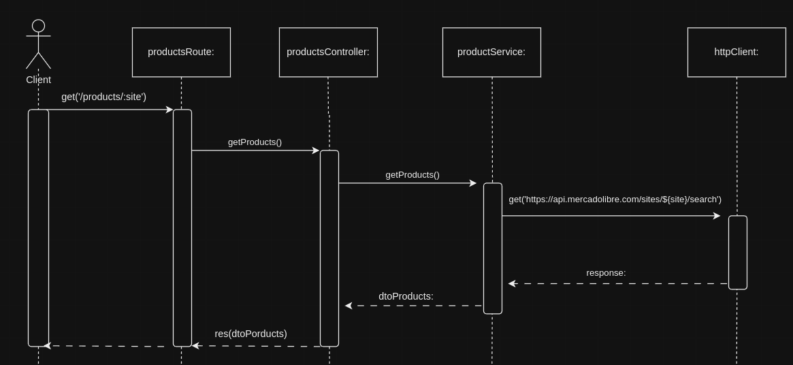
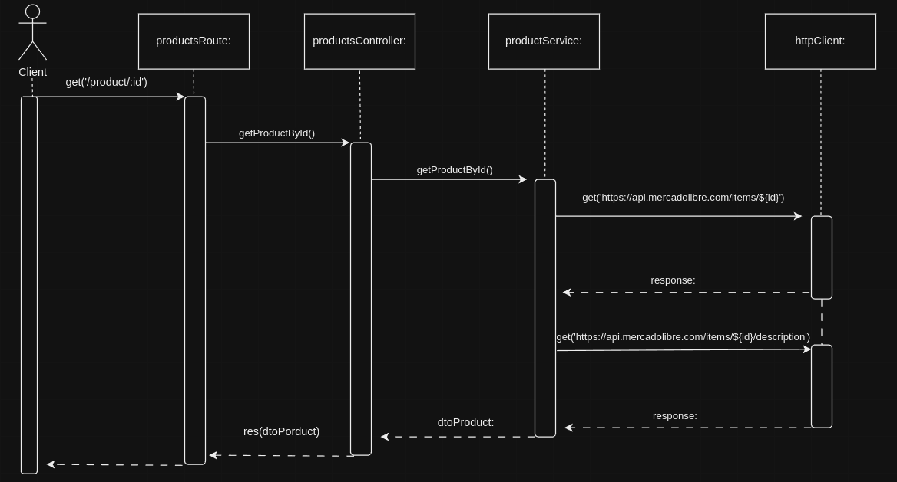

# Meli Challenge

To start the server, you have some way to run this server.

## Run in mode DEV

    1) npm install
    2) npm run start

## Run in mode PROD

    1) npm install
    2) npm run build
    3) npm run start:prod

## Run in Docker

### Pre requisite

\*\* Remember to have docker installed

    1) start:docker

## Endopoint's documentation

Then you start te server, please ask the next endpoint for get all documentation.

        <hostname:port>/docs

## Secuence Diagram

### Get products from Meli

### Get product by id from Meli

